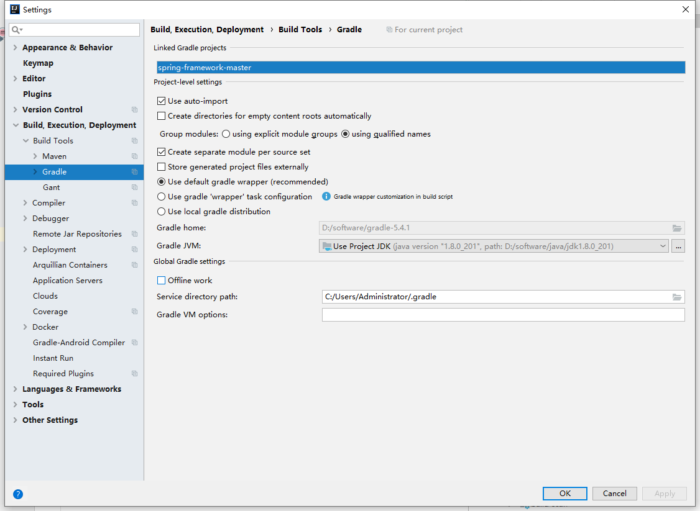
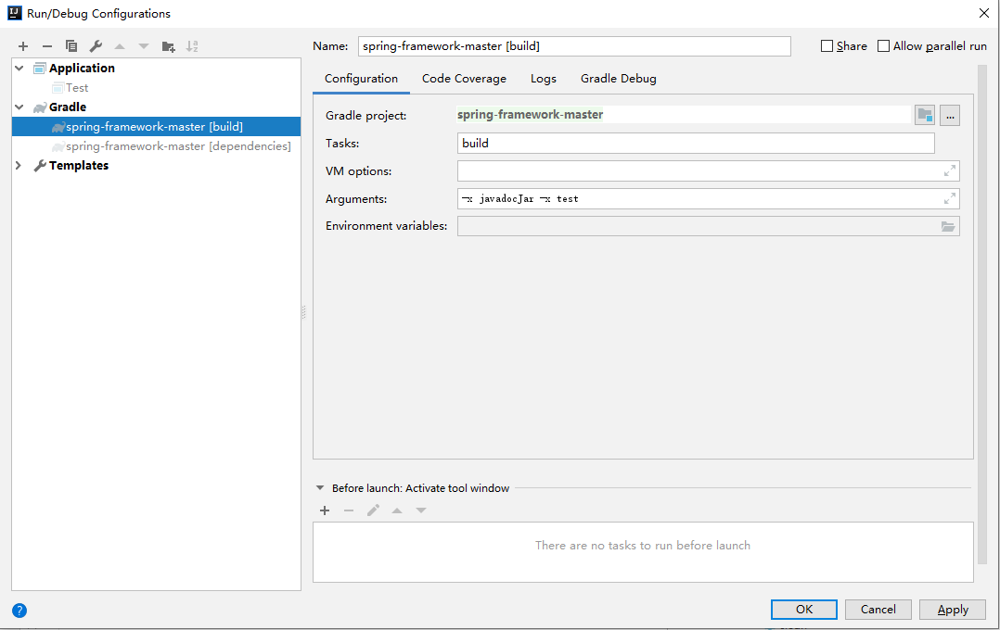

#  Spring Framework

This is the home of the Spring Framework, the foundation for all
[Spring projects](https://spring.io/projects). Together the Spring Framework and the family of Spring projects make up what we call "Spring". 

Spring provides everything you need beyond the Java language to create enterprise
applications in a wide range of scenarios and architectures. Please read the
[Overview](https://docs.spring.io/spring/docs/current/spring-framework-reference/overview.html#spring-introduction)
section in the reference for a more complete introduction.
## 我加的内容
编译后的测试入口工程为spring-cglib1的Test类，跟着该入口的方法去看中文注释的源码

## 编译过程
从官网下载的源码编译过程参考这个同学的博客：https://blog.csdn.net/baomw/article/details/83956300  
其实如果您本来就有很好的开发环境(其实我理解就是配合JDK环境变量，gradle用工程默认的，重点是给gradle设置阿里的资源库)，直接把我这份源码下载下来直接在根目录加上'-x javadocJar -x test'参数运行build命令就可以编译成功的了，如有意外请联系QQ:873091763  
 
  
此外附上我的init.gradle配置（这个位置放在用户目录的.gradle目录下，如：C:\Users\Administrator\.gradle\init.gradle）
```groovy
allprojects{
    repositories {
        def ALIYUN_REPOSITORY_URL = 'http://maven.aliyun.com/nexus/content/groups/public'
        def ALIYUN_JCENTER_URL = 'http://maven.aliyun.com/nexus/content/repositories/jcenter'
		def ALIYUN_SPRING_URL = 'https://maven.aliyun.com/repository/spring'
		def ALIYUN_SPRING_PLUGIN_URL = 'https://maven.aliyun.com/repository/spring-plugin'
        all { ArtifactRepository repo ->
            if(repo instanceof MavenArtifactRepository){
                def url = repo.url.toString()
                if (url.startsWith('https://repo1.maven.org/maven2')) {
                    project.logger.lifecycle "Repository ${repo.url} replaced by $ALIYUN_REPOSITORY_URL."
                    remove repo
                }
                if (url.startsWith('https://jcenter.bintray.com/')) {
                    project.logger.lifecycle "Repository ${repo.url} replaced by $ALIYUN_JCENTER_URL."
                    remove repo
                }
            }
        }
        maven {
            url ALIYUN_REPOSITORY_URL
            url ALIYUN_JCENTER_URL
            url ALIYUN_SPRING_URL
            url ALIYUN_SPRING_PLUGIN_URL
        }
    }
}
```


## Code of Conduct

This project is governed by the [Spring Code of Conduct](CODE_OF_CONDUCT.adoc).
By participating you are expected to uphold this code.
Please report unacceptable behavior to spring-code-of-conduct@pivotal.io.

## Access to Binaries

For access to artifacts or a distribution zip, see the
[Spring Framework Artifacts](https://github.com/spring-projects/spring-framework/wiki/Spring-Framework-Artifacts)
wiki page.

## Documentation

The Spring Frameworks maintains reference documentation
([published](http://docs.spring.io/spring-framework/docs/current/spring-framework-reference/) and
[source](src/docs/asciidoc)),
Github [wiki pages](https://github.com/spring-projects/spring-framework/wiki), and an
[API reference](http://docs.spring.io/spring-framework/docs/current/javadoc-api/).
There are also [guides and tutorials](https://spring.io/guides) across Spring projects.

## Build from Source

See the [Build from Source](https://github.com/spring-projects/spring-framework/wiki/Build-from-Source)
wiki page and also [CONTRIBUTING.md](CONTRIBUTING.md).

## Stay in Touch

Follow [@SpringCentral](https://twitter.com/springcentral),
[@SpringFramework](https://twitter.com/springframework), and its
[team members](https://twitter.com/springframework/lists/team/members) on Twitter.
In-depth articles can be found at [The Spring Blog](http://spring.io/blog/),
and releases are announced via our [news feed](http://spring.io/blog/category/news).

## License

The Spring Framework is released under version 2.0 of the
[Apache License](http://www.apache.org/licenses/LICENSE-2.0).
